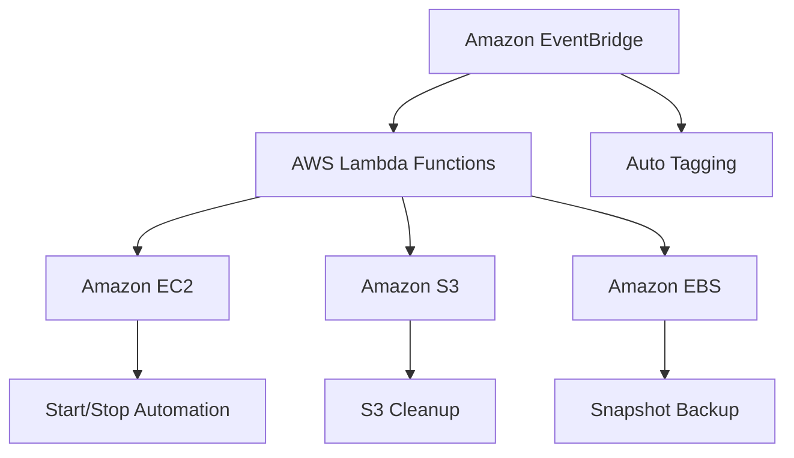
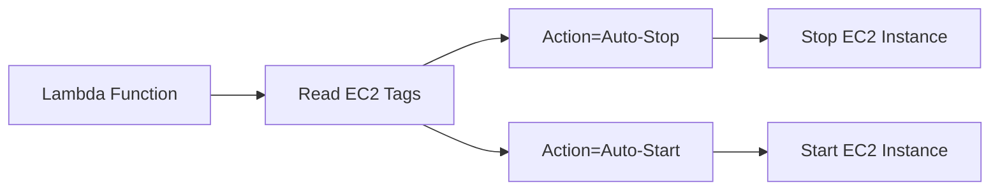
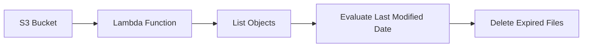
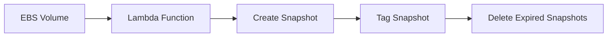
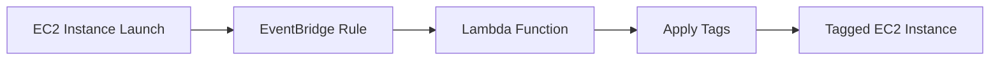

# 🚀 AWS Lambda & Boto3 Automation Assignments

<p align="center">


</p>

<p align="center">
<b>Serverless Cloud Automation using AWS Lambda, Python, Boto3, EC2, S3, EBS and EventBridge</b>
</p>

---

# 📖 Overview

This repository contains practical AWS cloud automation solutions implemented using **AWS Lambda** and **Boto3**.

The assignments demonstrate real-world automation patterns commonly used in cloud-native environments, including:

* 🚦 EC2 Lifecycle Automation
* 🧹 S3 Housekeeping Automation
* 💾 EBS Backup Automation
* 🏷️ Event-Driven EC2 Tagging

---

# 🏗️ Repository Structure

```text
aws-lambda-boto3-assignments
│
├── assignment-1-ec2-auto-start-stop
│   ├── lambda_function.py
│   └── screenshots
│
├── assignment-2-s3-cleanup
│   ├── lambda_function.py
│   └── screenshots
│
├── assignment-3-ebs-snapshot
│   ├── lambda_function.py
│   └── screenshots
│
├── assignment-4-auto-tag-ec2-instance-on-launch
│   ├── lambda_function.py
│   └── screenshots
│
└── README.md
```

---

# ☁️ Overall Architecture



---

# 🚦 Assignment 1 - EC2 Auto Start / Stop

## Objective

Automatically start and stop EC2 instances based on custom resource tags.

---

## Services Used

* AWS Lambda
* Amazon EC2
* IAM
* Boto3

---

## Architecture



---

## Workflow

1. Create EC2 instances.
2. Apply Action tags.
3. Lambda scans EC2 instances.
4. Instances tagged `Auto-Stop` are stopped.
5. Instances tagged `Auto-Start` are started.

---

## Screenshots

| Description                                      |
| ------------------------------------------------ |
| AutoStartStopInitialStage.png                    |
| AutoStartStopLambdaExecution.png                 |
| AutoStartStopLambdaExecutionEc2InstanceState.png |

---

# 🧹 Assignment 2 - S3 Bucket Cleanup

## Objective

Automatically delete expired files from an Amazon S3 bucket.

---

## Services Used

* AWS Lambda
* Amazon S3
* IAM
* Boto3

---

## Architecture



---

## Workflow

1. Create S3 bucket.
2. Upload sample files.
3. Lambda scans bucket contents.
4. Files older than retention period are deleted.
5. Cleanup result is returned.

---

## Screenshots

| Description                         |
| ----------------------------------- |
| S3BucketWithFiles.png               |
| filesDeletedByLambdaFunction.png    |
| NoFilesInTheBucketAfterDeletion.png |

---

# 💾 Assignment 3 - EBS Snapshot Automation

## Objective

Automatically create EBS snapshots and implement backup retention logic.

---

## Services Used

* AWS Lambda
* Amazon EBS
* Amazon EC2
* IAM
* Boto3

---

## Architecture



---

## Workflow

1. Identify EBS Volume.
2. Lambda creates snapshot.
3. Snapshot is tagged.
4. Existing snapshots are evaluated.
5. Snapshots exceeding retention policy are deleted.

---

## Screenshots

| Description                          |
| ------------------------------------ |
| beforeEbsSnapshotVolume.png          |
| EbsSnapshotLambdaExecutionResult.png |
| snapshot-created-by-lambda.png       |

---

# 🏷️ Assignment 4 - EC2 Auto Tagging on Launch

## Objective

Automatically tag newly launched EC2 instances using EventBridge and Lambda.

---

## Services Used

* AWS Lambda
* Amazon EC2
* Amazon EventBridge
* IAM
* Boto3

---

## Architecture



---

## Tags Applied

| Tag         | Purpose                    |
| ----------- | -------------------------- |
| LaunchDate  | Instance creation date     |
| CreatedBy   | Automation owner           |
| Environment | Environment classification |

---

## Workflow

1. EventBridge monitors EC2 state changes.
2. EC2 enters Running state.
3. EventBridge triggers Lambda.
4. Lambda applies predefined tags.
5. Instance becomes automatically tagged.

---

## Screenshots

| Description                              |
| ---------------------------------------- |
| iam-role-for-ec2-access-created.png      |
| lambda-function-created.png              |
| EventBridgeRuleCreated.png               |
| EventBridgeRuleTarget.png                |
| tags-updated-automatically-on-launch.png |

---

# 🔐 Security Considerations

For educational purposes, AWS managed policies were used:

* AmazonEC2FullAccess
* AmazonS3FullAccess
* AmazonS3ReadOnlyAccess

In production environments, the Principle of Least Privilege (PoLP) should always be followed.

---

# 🛠️ Technology Stack

| Category          | Technology         |
| ----------------- | ------------------ |
| Language          | Python 3.13        |
| Cloud Platform    | AWS                |
| SDK               | Boto3              |
| Compute           | AWS Lambda         |
| Storage           | Amazon S3          |
| Compute Resources | Amazon EC2         |
| Backup            | Amazon EBS         |
| Event Processing  | Amazon EventBridge |
| Security          | IAM                |

---

# 🎯 Key Learnings

✅ AWS Lambda Development

✅ Serverless Architecture

✅ Boto3 SDK Integration

✅ EC2 Automation

✅ S3 Lifecycle Management

✅ EBS Backup & Recovery

✅ Event-Driven Architecture

✅ IAM Security & Permissions

✅ Cloud Resource Automation

---

# 👨‍💻 Author

## Manikandan Muthu

**Senior Software Engineer**

Java | Spring Boot | AWS | Kubernetes | Microservices | ReactJS

---

⭐ If you found this repository useful, consider giving it a star.
